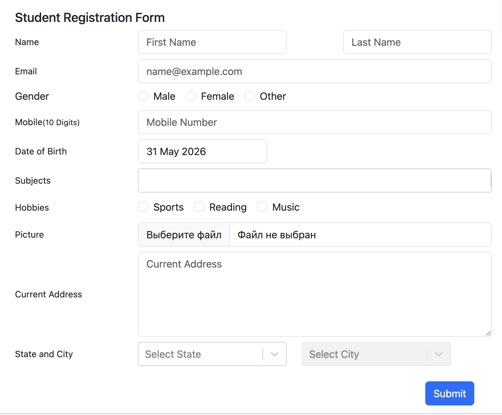
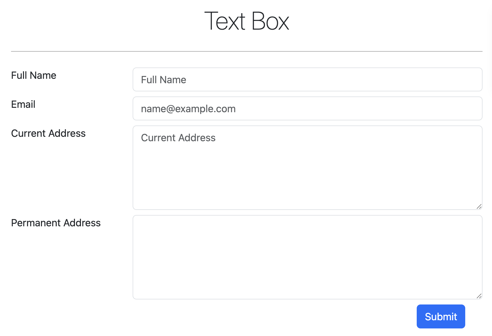

## 🧪 DemoQA Automated Tests

## 📋 О проекте

Автоматизированные тесты для сайта **[DemoQA](https://demoqa.com/)**.  
Проект включает тестирование двух основных форм:

- **Student Registration Form** — форма регистрации студентов



- **Text Box** — форма для ввода текстовых данных



Проект демонстрирует подходы к тестированию веб-формы с использованием **Selenide** и **JUnit 5**, включая позитивные и негативные сценарии, валидацию полей и проверку модальных окон.

---
## 🛠 Технологический стек

| Технология    | Версия             | Назначение |
|---------------|--------------------|-------------|
| **Java**      | 17                 | Язык программирования |
| **Selenide**  | 7.7.0              | Фреймворк для UI тестирования |
| **JUnit 5**   | 5.10.0             | Тестовый фреймворк |
| **Gradle**    | 8.10               | Система сборки |
| **Окружение** | macOS Sequoia 15.2 |  |
| **Браузер**  | Chrome 148.0.7778.216 |  |

---

## 🚀 Запуск тестов

### Локальный запуск

```bash
# Клонирование репозитория
git clone https://github.com/RenataFatykhov/java_demoqa_hw.git

# Переход в директорию
cd java_demoqa_hw

# Запуск всех тестов
./gradlew clean test

# Запуск конкретного теста
./gradlew test --tests StudentRegistrationFormTests
./gradlew test --tests TextBoxTests

# Запуск с детальным логированием
./gradlew test --info
```

## 📁 Структура проекта
```
java_demoqa_hw/
├── src/
│   └── test/
│       └── java/
│           ├── StudentRegistrationFormTests.java    # Тесты формы регистрации
│           ├── TextBoxTests.java                    # Тесты Text Box формы
│           └── TestBase.java                        # Базовый класс с настройками
├── build/
│   └── reports/
│       └── tests/
│           └── test/
│               └── index.html                       # HTML отчет о тестах
├── screenshots/                                     # Скриншоты для README
│   └── reg_form.png
│   └── text_boxform.png
├── build.gradle                                     # Конфигурация Gradle
└── README.md                                        # Документация
```
## 🎯 Тестируемый функционал

### Student Registration Form (6 тестов)

| Тест-кейс                      | Описание |
|--------------------------------|----------|
| ✅ **Полное заполнение формы**  | Все поля формы (обязательные и опциональные) |
| ✅ **Только обязательные поля** | Минимальный набор данных для успешной регистрации |
| ✅ **Пустая форма**             | Проверка валидации при отправке незаполненной формы |
| ✅ **Валидация телефона**       | Проверка ограничения на количество символов (10 цифр) |
| ✅ **Радиобатоны Gender**       | Взаимоисключающий выбор пола |
| ✅ **Закрытие модального окна** | Проверка исчезновения окна после нажатия на кнопку закрытия |

### Text Box (2 теста)

| # | Сценарий | Описание |
|---|----------|----------|
| 1 | Заполнение всех полей формы | Ввод данных во все поля и проверка вывода |
| 2 | Ввод невалидного email | Проверка валидации email поля (красная рамка) |

---


## 📊 Результаты тестирования

### Student Registration Form

```
✅ PASSED: 5                       
❌ FAILED: 1                      
📊 Total: 6                        
📈 Success Rate: 83.3%            
⏱ Total Time: 21.655 sec            
```

### Text Box

```
✅ PASSED: 2                      
❌ FAILED: 0                      
📊 Total: 2                        
📈 Success Rate: 100%            
⏱ Total Time: 5.54 sec            
```

### Детальные результаты

### Student Registration Form

| # | Тест-кейс | Статус | Время | Описание |
|---|-----------|--------|-------|----------|
| 1 | Заполнение всех полей формы | ✅ PASSED | ~3.5s | Полная регистрация со всеми данными |
| 2 | Заполнение только обязательных полей | ✅ PASSED | ~3.2s | Минимальный набор данных |
| 3 | Отправка пустой формы | ✅ PASSED | ~4.1s | Проверка валидации обязательных полей |
| 4 | Ввод недопустимого количества символов в поле 'Mobile' | ✅ PASSED | ~3.8s | 11 символов → обрезается до 10 |
| 5 | В группе радиобатонов 'Gender' можно выбрать только один вариант | ✅ PASSED | ~2.5s | Взаимоисключающий выбор |
| 6 | Модальное окно исчезает после нажатия на кнопку закрытия | ❌ FAILED | ~4.5s | Ожидание/проверка закрытия |

### Text Box

| # | Тест-кейс | Статус | Время | Описание |
|---|-----------|--------|-------|----------|
| 1 | Заполнение всех полей формы | ✅ PASSED | ~2.3s | Ввод данных во все поля и проверка вывода |
| 2 | Ввод невалидного email | ✅ PASSED | ~2.8s | Проверка валидации email поля (красная рамка)  |

---

## ⏱ Время выполнения тестов

### Student Registration Form

| # | Тест | Время | График |
|---|------|-------|--------|
| 1 | Заполнение всех полей | 3.5s | ████████░░░░░░░░░░ |
| 2 | Только обязательные поля | 3.2s | ███████░░░░░░░░░░ |
| 3 | Отправка пустой формы | 4.1s | ██████████░░░░░░░░ |
| 4 | Валидация телефона | 3.8s | █████████░░░░░░░░ |
| 5 | Радиобатоны Gender | 2.5s | ██████░░░░░░░░░░ |
| 6 | Закрытие модального окна | 4.5s | ███████████░░░░░░ |

**Общее время: 21.7 секунды**

### Text Box

| # | Тест | Время | График |
|---|------|-------|--------|
| 1 | Заполнение всех полей формы | 3.5s | ████████░░░░░░░░░░ |
| 2 | Ввод невалидного email | 3.2s | ███████░░░░░░░░░░ |

**Общее время: 5.5 секунды**

## 🐛 Анализ падающего теста

### Тест: `Модальное окно исчезает после нажатия на кнопку закрытия`

**Ожидаемое поведение:**
- Модальное окно появляется после успешной отправки формы
- После клика на кнопку закрытия (`#closeLargeModal`) окно исчезает (`Element should be not visible {.modal-content`}
  )

**Фактическое поведение:**
- Модальное окно появляется после успешной отправки формы
- После клика на кнопку закрытия (`#closeLargeModal`) окно `НЕ` исчезает (`Actual value: visible`)

**Возможные причины падения:**
- Кнопка закрытия не кликабельна в момент выполнения

---


## 👥 Автор

**Renata Fatykhova**  
QA Automation Engineer